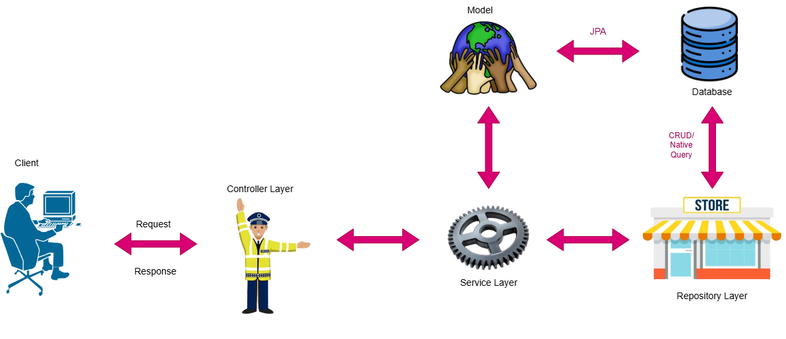
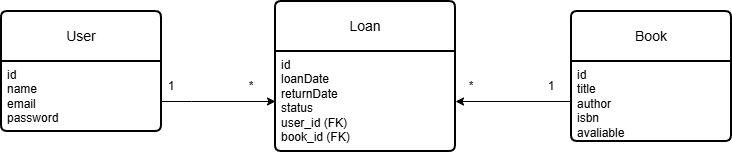
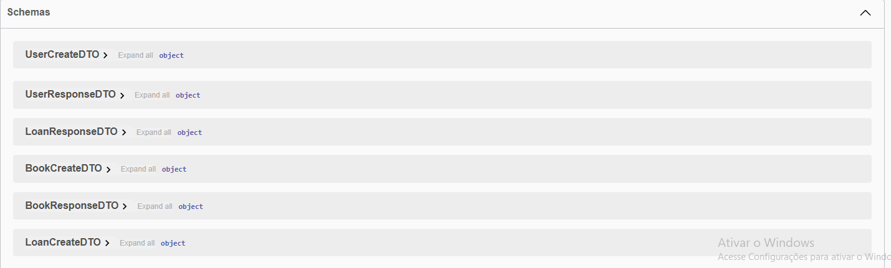
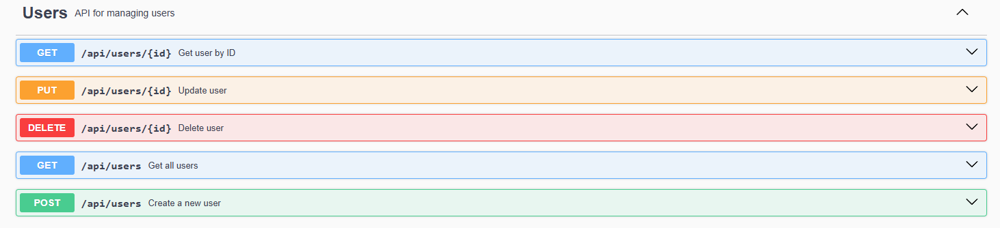
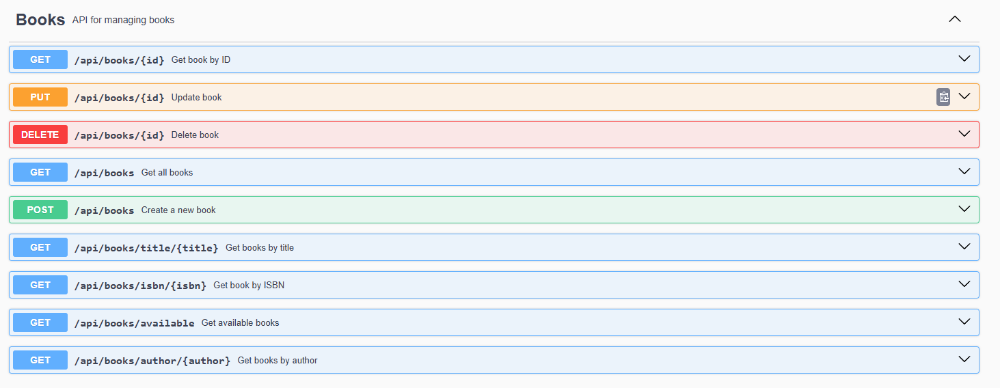
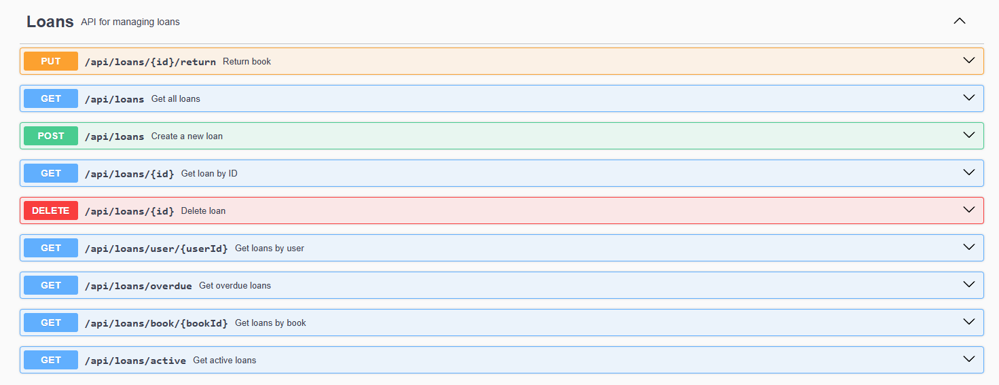

# 📚 Library API

API REST desenvolvida com **Spring Boot** para gerenciamento de uma biblioteca.
O sistema permite cadastrar usuários, livros e controlar empréstimos e devoluções.

## 🚀 Tecnologias utilizadas

* Java 17
* Spring Boot
* Spring Data JPA
* Hibernate
* Maven
* Swagger / OpenAPI
* H2 Database (ou o banco que você estiver usando)

---

## 🏗️ Arquitetura do projeto

O projeto segue uma arquitetura em camadas:

## 🏗️ Arquitetura



```
Client --> Controller
Controller --> Service
Service --> Repository
Repository --> Database
```

## 📊 Modelo de Dados



Além disso, utiliza:

* **DTOs** para transferência de dados
* **Mappers** para conversão entre DTO e Entity
* **Exception Handler** para tratamento global de erros
* **Swagger** para documentação da API

Estrutura principal:

```
src/main/java/com/vinicios/library

controllers
services
repositories
entities
dtos
mappers
config
exceptions
```

---

## 📖 Funcionalidades

* Cadastro de usuários
* Cadastro de livros
* Realização de empréstimos
* Devolução de livros
* Regras de negócio para controle de empréstimos

Exemplo de regras:

* Um livro não pode ser emprestado se já estiver emprestado
* Um usuário possui limite de empréstimos simultâneos
* Controle de status de empréstimo

---

## 🔗 Endpoints principais

### Usuários

```
POST /api/users
GET /api/users
GET /api/users/{id}
```

### Livros

```
POST /api/books
GET /api/books
GET /api/books/{id}
```

### Empréstimos

```
POST /api/loans
GET /api/loans
PUT /api/loans/{id}/return
```

---

## 📑 Documentação da API

A documentação interativa da API está disponível através do **Swagger**.

Após iniciar a aplicação, acesse:

```
http://localhost:8080/swagger-ui/index.html
```





---

## ▶️ Como executar o projeto

Clone o repositório:

```
git clone https://github.com/SEU-USUARIO/library-api.git
```

Entre na pasta do projeto:

```
cd library-api
```

Execute a aplicação:

```
mvn spring-boot:run
```

A API estará disponível em:

```
http://localhost:8080
```

---

## 👨‍💻 Autor

Projeto desenvolvido para fins de estudo utilizando **Spring Boot**.

Vinicios
